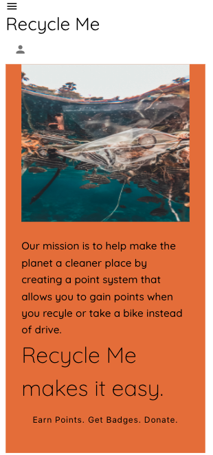

# Recycle Me

## Description 

Recycle me is an app that allows a user to login and track how much they were able to save the Earth by recycling or by an activity (such as walking) that will lead to a smaller footprint.  Tracking recycling actitivies also allows for points to be earned.  A running total of points will be displayed on the user's login page.

### Technologies Used

* React
* GraphQL
* Mongoose
* Apollo Server Express
* Node
* JSX
* Material UI
* Express
* JSON Web Token
* BCrypt

## User Stories

* As a user, I want to be able to login to Recycle Me app and track my recycling activity.

* As a user, I want to be able to earn points and badges.

### Screenshot

https://github.com/Putridjungle602/Recycle-Me

https://recycle-mee.herokuapp.com/
